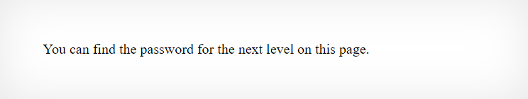
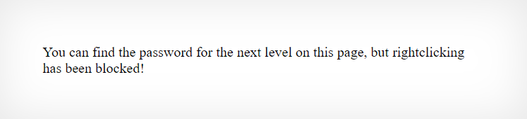
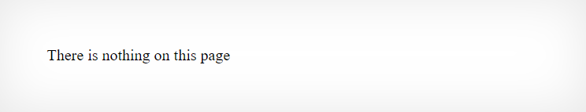
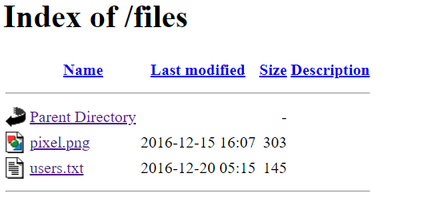
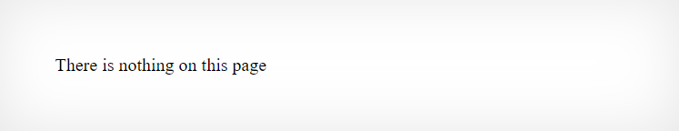
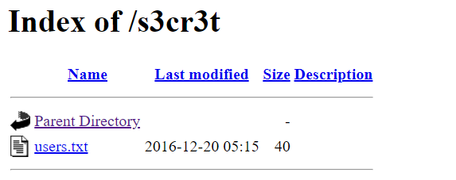
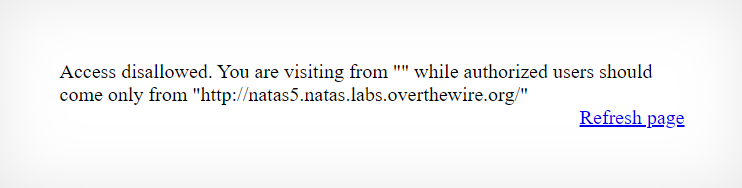
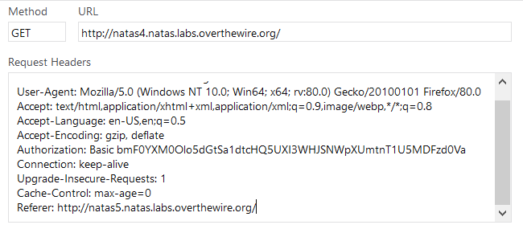
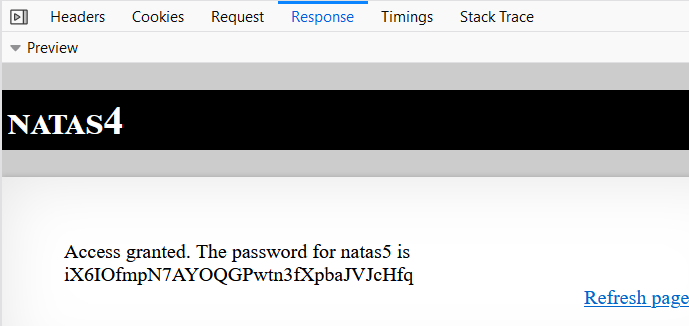

## What is Natas OverTheWire ?

Challenges yang disediakan Natas mengajarkan dasar dasar dari keamanan website dari sisi server.

Setiap level menyimpan password yang dapat digunakan untuk mengakses level selanjutnya. Tujuan kita adalah dengan bagaimanapun caranya mendapatkan password berikutnya dan berpindah ke level yang lebih tinggi dan lebih menantang. Semua password juga disimpan di /etc/natas_webpass/natas(n) dan cuma bisa diakses oleh natas(n-1) dan natas(n+1)

Natas OverTheWire dibuka untuk umum dan dapat di akses melalui link [berikut](https://overthewire.org/wargames/natas/)


# Level 00
[http://natas0.natas.labs.overthewire.org/](http://natas0.natas.labs.overthewire.org/)

natas0:natas0



Diberikan tampilan awal website challenge seperti diatas, kita bisa mendapatkan flag dengan membuka page source

```
<html>
<head>
<!-- This stuff in the header has nothing to do with the level -->
<link rel="stylesheet" type="text/css" href="http://natas.labs.overthewire.org/css/level.css">
<link rel="stylesheet" href="http://natas.labs.overthewire.org/css/jquery-ui.css" />
<link rel="stylesheet" href="http://natas.labs.overthewire.org/css/wechall.css" />
<script src="http://natas.labs.overthewire.org/js/jquery-1.9.1.js"></script>
<script src="http://natas.labs.overthewire.org/js/jquery-ui.js"></script>
<script src=http://natas.labs.overthewire.org/js/wechall-data.js></script><script src="http://natas.labs.overthewire.org/js/wechall.js"></script>
<script>var wechallinfo = { "level": "natas0", "pass": "natas0" };</script></head>
<body>
<h1>natas0</h1>
<div id="content">
You can find the password for the next level on this page.

<!--The password for natas1 is gtVrDuiDfck831PqWsLEZy5gyDz1clto -->
</div>
</body>
</html>
```


# Level 01
[http://natas1.natas.labs.overthewire.org/](http://natas1.natas.labs.overthewire.org/)

natas1:gtVrDuiDfck831PqWsLEZy5gyDz1clto



Diberikan tampilan awal website challenge mirip seperti challenge 0, kita bisa menggunakan cara yang sama namun klik kanan di block, jadi kita bisa menggunakan CTRL-U untuk membuka source page

```
<html>
<head>
<!-- This stuff in the header has nothing to do with the level -->
<link rel="stylesheet" type="text/css" href="http://natas.labs.overthewire.org/css/level.css">
<link rel="stylesheet" href="http://natas.labs.overthewire.org/css/jquery-ui.css" />
<link rel="stylesheet" href="http://natas.labs.overthewire.org/css/wechall.css" />
<script src="http://natas.labs.overthewire.org/js/jquery-1.9.1.js"></script>
<script src="http://natas.labs.overthewire.org/js/jquery-ui.js"></script>
<script src=http://natas.labs.overthewire.org/js/wechall-data.js></script><script src="http://natas.labs.overthewire.org/js/wechall.js"></script>
<script>var wechallinfo = { "level": "natas1", "pass": "gtVrDuiDfck831PqWsLEZy5gyDz1clto" };</script></head>
<body oncontextmenu="javascript:alert('right clicking has been blocked!');return false;">
<h1>natas1</h1>
<div id="content">
You can find the password for the
next level on this page, but rightclicking has been blocked!

<!--The password for natas2 is ZluruAthQk7Q2MqmDeTiUij2ZvWy2mBi -->
</div>
</body>
</html>
```


# Level 02
[http://natas2.natas.labs.overthewire.org/](http://natas2.natas.labs.overthewire.org/)

natas2:ZluruAthQk7Q2MqmDeTiUij2ZvWy2mBi



Seperti challenge sebelumnya kita akan melihat source code page nya

```
<html>
<head>
<!-- This stuff in the header has nothing to do with the level -->
<link rel="stylesheet" type="text/css" href="http://natas.labs.overthewire.org/css/level.css">
<link rel="stylesheet" href="http://natas.labs.overthewire.org/css/jquery-ui.css" />
<link rel="stylesheet" href="http://natas.labs.overthewire.org/css/wechall.css" />
<script src="http://natas.labs.overthewire.org/js/jquery-1.9.1.js"></script>
<script src="http://natas.labs.overthewire.org/js/jquery-ui.js"></script>
<script src=http://natas.labs.overthewire.org/js/wechall-data.js></script><script src="http://natas.labs.overthewire.org/js/wechall.js"></script>
<script>var wechallinfo = { "level": "natas2", "pass": "ZluruAthQk7Q2MqmDeTiUij2ZvWy2mBi" };</script></head>
<body>
<h1>natas2</h1>
<div id="content">
There is nothing on this page

</div>
</body></html>
```

Kita bisa melihat ada img src tag ke files/pixel.png, mari kita cek ada apa sebenarnya di directory files.



Ternyata kita bisa melihat directory dan files didalamnya, hal ini terjadi karena misconfiguration pada htaccess yang tidak menonaktifkan Indexes.

Membuka users.txt kita akan mendapatkan flag untuk challenge selanjutnya

```
# username:password
alice:BYNdCesZqW
bob:jw2ueICLvT
charlie:G5vCxkVV3m
natas3:sJIJNW6ucpu6HPZ1ZAchaDtwd7oGrD14
eve:zo4mJWyNj2
mallory:9urtcpzBmH
```


# Level 03
[http://natas3.natas.labs.overthewire.org/](http://natas3.natas.labs.overthewire.org/)

natas3:sJIJNW6ucpu6HPZ1ZAchaDtwd7oGrD14



Challenge kali ini memiliki tampilan sama persis dengan challenge sebelumnya, namun ada hint keras di page source nya

```
<html>
<head>
<!-- This stuff in the header has nothing to do with the level -->
<link rel="stylesheet" type="text/css" href="http://natas.labs.overthewire.org/css/level.css">
<link rel="stylesheet" href="http://natas.labs.overthewire.org/css/jquery-ui.css" />
<link rel="stylesheet" href="http://natas.labs.overthewire.org/css/wechall.css" />
<script src="http://natas.labs.overthewire.org/js/jquery-1.9.1.js"></script>
<script src="http://natas.labs.overthewire.org/js/jquery-ui.js"></script>
<script src=http://natas.labs.overthewire.org/js/wechall-data.js></script><script src="http://natas.labs.overthewire.org/js/wechall.js"></script>
<script>var wechallinfo = { "level": "natas3", "pass": "sJIJNW6ucpu6HPZ1ZAchaDtwd7oGrD14" };</script></head>
<body>
<h1>natas3</h1>
<div id="content">
There is nothing on this page
<!-- No more information leaks!! Not even Google will find it this time... -->
</div>
</body></html>
```

"Not even Google will find it this time..." Mari kita coba membuka robots.txt karena bagian Disallow di robots.txt berarti bot crawler google tidak bisa melakukan crawling di page yang ditentukan



Kita bisa membuka users.txt dan mendapatkan password level selanjutnya

```
natas4:Z9tkRkWmpt9Qr7XrR5jWRkgOU901swEZ
```


# Step 04
[http://natas4.natas.labs.overthewire.org/](http://natas4.natas.labs.overthewire.org/)

natas4:Z9tkRkWmpt9Qr7XrR5jWRkgOU901swEZ


Menurut petunjuk diatas kita perlu menambahkan HTTP Header "Referer" sesuai dengan yang ditentukan oleh challenge ini



Mari kita coba cek network tab di browser, bisa dibuka dengan F12
Saya menggunakan firefox untuk mengedit header HTTP request, dan menambahkan "Referer" ketika di send lagi kita akan mendapatkan flag untuk level selanjutnya. Ada banyak cara untuk mengedit HTTP Header tadi, seperti menggunakan proxy Burpsuite dll.



Berhasil mendapatkan flag level selanjutnya


# Step 05
[http://natas4.natas.labs.overthewire.org/](http://natas4.natas.labs.overthewire.org/)

natas5:iX6IOfmpN7AYOQGPwtn3fXpbaJVJcHfq

